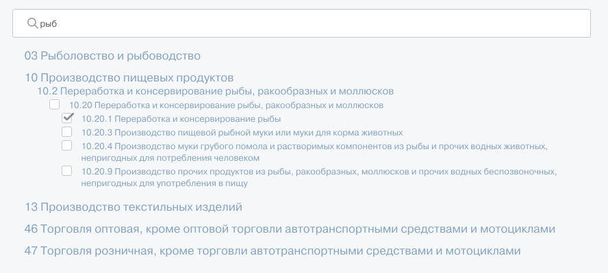

Задача
1.Вывести иерархические данные в виде дерева. Файл с данными, которые нужно использовать при выполнении задания, прикреплен к письму. Данные можно отдавать c удобного для вас веб-сервера или реализовать сервер на Node.js.

2.Сделать сворачивание и разворачивание списка дочерних элементов по клику. По умолчанию все свернуто.

3.Около каждого элемента списка показывать checkbox, позволяющий выбрать текущий и все дочерние элементы.
3.1 Если все дочерние элементы выбраны вручную, то родительский элемент должен выбираться автоматически.
3.2 Если наоборот с любого дочернего элемента снят выбор, то снимается и с родительского.

4.Добавить текстовое поле для фильтрации элементов по вхождению текста. При фильтрации сохранять исходную свернутость/развернутость элементов. Если в заголовке родителя нет искомого текста, но есть в дочернем, то родитель тоже показан.

5.Сделать перетаскивание элементов и прикрепление к другой родительской вершине.

6.Обратить внимание на производительность и скорость работы интерфейса приложения.

Технологии
Angular 5+, можно использовать Angular CLI.

Пример

Развернутое дерево (чекбоксы сделать у всех элементов, а не как на скриншоте):

После фильтрации:

